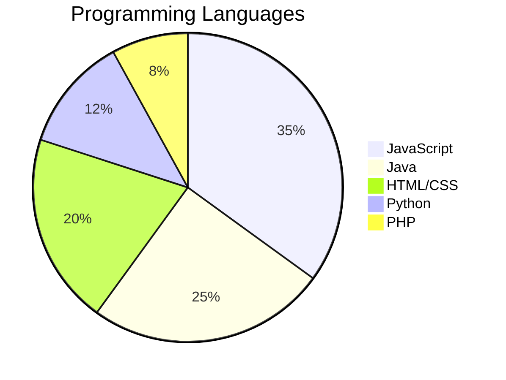
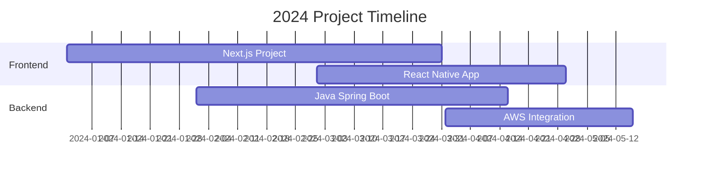

<div align="center">
  
</div>

# <div align="center">👋 Hello World, I'm Ziyadha Fazly!

【ziyadha】

</div>

<div align="center">
  <a href="mailto:ziyadhafazly@gmail.com">
    
  </a>
  <a href="https://linkedin.com/in/ziyadhafazly">
    
  </a>
  <a href="https://medium.com/@ziyadhafazly">
    
  </a>
</div>

<div align="center">
  
  
  
  
</div>

## 📊 Performance Dashboard

### 📊 Contribution Activity
[](https://github.com/ashutosh00710/github-readme-activity-graph)

### 📈 Contribution Metrics
<div align="center">
  
</div>

<div align="center">
  
  
  
</div>

## 🎯 Skills & Expertise

### 💻 Technical Proficiency


### 🌟 Skill Progress

<details>
<summary>Frontend Development</summary>
<br/>
<p align="left">
████████████████████░░░░ 90%
</p>
</details>

<details>
<summary>Backend Development</summary>
<br/>
<p align="left">
███████████████░░░░░░░░░ 75%
</p>
</details>

<details>
<summary>Database Management</summary>
<br/>
<p align="left">
██████████████████░░░░░░ 80%
</p>
</details>

<details>
<summary>UI/UX Design</summary>
<br/>
<p align="left">
███████████████░░░░░░░░░ 75%
</p>
</details>

<details>
<summary>Cloud Services</summary>
<br/>
<p align="left">
████████████░░░░░░░░░░░░ 60%
</p>
</details>

## 🎓 About Me

I'm a dedicated Full Stack Developer with a passion for creating efficient and scalable web applications. Currently advancing my skills in modern web technologies and cloud computing, I bring a detail-oriented approach to solving complex technical challenges.

### 📊 Weekly Development Breakdown
```text
JavaScript   10 hrs 15 mins  ███████████░░░░░░   50.25%
Java         6 hrs 30 mins   ██████░░░░░░░░░░░   28.50%
HTML/CSS     3 hrs 45 mins   ████░░░░░░░░░░░░░   15.75%
Python       1 hr 05 mins    ██░░░░░░░░░░░░░░░    5.50%
```

## 🚀 Current Focus & Projects

### Project Timeline


---

### 🎯 2024 Goals Progress

<table>
  <tr>
    <td>Cloud Certification</td>
    <td>
      
    </td>
  </tr>
  <tr>
    <td>Full Stack Projects</td>
    <td>
      
    </td>
  </tr>
  <tr>
    <td>Code Contributions</td>
    <td>
      
    </td>
  </tr>
  <tr>
    <td>Technical Writing</td>
    <td>
      
    </td>
  </tr>
</table>

## 💻 Technical Skills

### Languages & Frameworks

Frontend     →  HTML5, CSS3, JavaScript, React.js, Next.js
Backend      →  Java, Spring Boot, Node.js, Python
Database     →  MongoDB, MySQL, PostgreSQL
Tools        →  Git, Docker, AWS, Jenkins


### Currently Exploring
- 🔍 Microservices Architecture
- 🌐 Cloud Native Development
- 📊 System Design Patterns
- 🎨 Progressive Web Apps

## 📈 GitHub Statistics

<div align="center">
  
  
</div>

<div align="center">
  
</div>

## 🤝 Let's Connect!

<div align="center">
  <p>Always eager to collaborate on innovative projects and share knowledge!</p>
  <a href="https://www.facebook.com/ziyadhafazly">
    
  </a>
  <a href="http://www.youtube.com/@ziyadhafazly">
    
  </a>
  <a href="https://www.hackerrank.com/ziyadhafazly">
    
  </a>
</div>

## 💪 Support My Work

<div align="center">
  
  <p>Happy Coding! 👨‍💻</p>
</div>

<div align="center">
  <a href="https://www.buymeacoffee.com/ziyadhafazly">
    
  </a>
</div>
